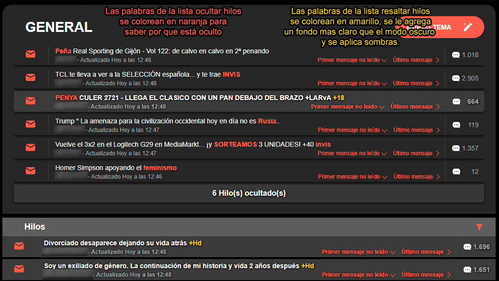

  
  <h1 align="center">Roto2Tools</h1>
  
Userscript para mejorar tu experiencia en <strong>Forocoches</strong> 🐴

## ✨ Características

### 🧵 Gestión de Hilos
- 🔴 Añadir palabras para **ocultar hilos** — la palabra se resalta en naranja
- 🟡 Añadir palabras para **resaltar hilos** — fondo oscuro en el recuadro del hilo
- ⭐ Hilos favoritos marcados con **estrella dorada** en el listado
- 📐 Adaptar el foro al ancho de pantalla sin espacios vacíos

### 👤 Gestión de Usuarios
- 🟢 **Resaltar mensajes** de contactos con barra verde a la izquierda |
- 🙈 **Ocultar mensajes** de usuarios ignorados con spoiler colapsable |
- 💬 **Ocultar citas** de usuarios ignorados con spoiler colapsable |
- 📥 Importar lista de amigos/ignorados directamente desde Forocoches |

### 🕓 Historial & Favoritos
- Registro automático de hilos visitados con acceso rápido desde el header
- Guarda hilos como favoritos desde el listado o desde dentro del propio hilo
- Dropdown con pestañas de **Historial** y **Favoritos** en el header

### 📝 Notas & Copypastas
- Bloc de notas integrado directamente en el header
- Soporte para **copiar al portapapeles** con un clic
- Edición, borrado y organización de notas

### ⚙️ Panel de Ajustes
- 🎨 Colores de resaltado/ocultado personalizables para hilos y usuarios
- 📏 Expandir el layout al 100% de ancho
- 🔢 Límite configurable de entradas en el historial (10–500)
- 🪪 Ocultar la columna lateral de ID
- 💾 Activar/desactivar CSS personalizado (`cust0mMensajes`)
- ⭐ Botón de favorito dentro del hilo
- 📖 Registro automático del historial

### 💾 Backup
- Exportar e importar backup completo en **JSON** (listas, favoritos, notas y ajustes)

### 🔔 Otras funciones
- Notificaciones **toast** para feedback de acciones (guardar, importar, exportar, errores...)
- Detección automática del tema del foro ☀️/🌙 y sincronización con el panel

## 📸 Capturas

  

## 🧩 Extensiones soportadas

| Extensión | Compatible |
|:---------:|:----------:|
| Violentmonkey | ✅ |
| Tampermonkey | ✅ |

## ⚠️ Compatibilidad

> Solo funciona con el **nuevo diseño de Forocoches**.
> ❌ No compatible con versión móvil ni diseño clásico.
